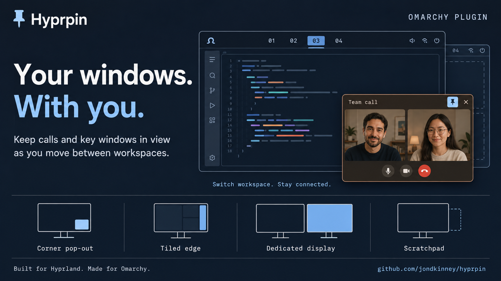

# Hyprpin



Keeps chosen windows visible when you switch away from their workspace: moved
onto a display of their own, parked in a corner, or tucked into the scratchpad
a keypress away. Compositor-level picture-in-picture, for the calls a browser
will only do this for inside a tab.

Click the bar icon, pick a window from **Open windows**, then choose a display
and a placement for it. From then on, whenever the workspace behind that window
stops being the one on screen, the window floats to where you said and pins
itself to every workspace. Switch back to its home workspace and it goes back
exactly as it was -- same workspace, same size, same position, same tiled or
floating state.

[View the settings panel](docs/settings-panel.jpg).

## Switching it off

The bar icon's drop-down has an on/off switch on its title row. Off hands
every pop-out back where it came from and stops anything following you; your
rules are kept, and on resumes them. The icon dims while it is off.

**Right-click the bar icon** to flip the same switch without opening anything.

While off, **SUPER+O** and **SUPER+T** fall through to their stock behaviour
(the centered 65%x95% pop, and the plain float/tile toggle).

## Install

```bash
omarchy plugin add https://github.com/jondkinney/hyprpin
omarchy bar move io.github.jondkinney.hyprpin --section right
omarchy restart shell
```

The restart matters: the service half only starts on a full shell restart,
and `rescanPlugins` alone will not bring it up.

## Remove

```bash
omarchy plugin remove io.github.jondkinney.hyprpin
omarchy restart shell
```

The plugin never touches your Hyprland config; the engine lives in Hyprland's
Lua state and disappears with it. Rules and remembered sizes are kept in
`~/.local/state/omarchy/hyprpin.json` and `~/.local/state/omarchy/hyprpin-sizes.json`
-- delete those two files to forget everything.

## How it works

Hyprland's `pin` does more than mark a window: pinning one that lives on a
hidden workspace pulls it onto the visible one. That is the whole mechanism.
Unpinning is the mirror image and drops the window wherever you happen to be,
which is why the engine sends a window home by workspace name instead.

The engine itself is Lua, generated by `Service.qml` and pushed into Hyprland
with `hyprctl eval`. It runs inside Hyprland's own Lua state rather than in the
shell, so it gets the `workspace.active` event with no IPC round trip and keeps
working if the shell restarts. A `hyprctl reload` wipes that state, so the
service re-applies whenever Hyprland reports `configreloaded`.

## Rules

Rules live in `~/.local/state/omarchy/hyprpin.json` and are safe to hand-edit;
the widget and the service both reload on change. The watcher keys on
directory entries, so it sees any editor that saves by rename (which is how
editors save) -- an in-place append from a shell redirect is only picked up
on the next change or restart.

```json
{
  "version": 1,
  "enabled": true,
  "rules": [
    { "class": "^Zoom$", "title": "^Meeting$", "monitor": "DVI-I-1", "placement": "fill" }
  ]
}
```

- `enabled` -- the global switch (see above). Missing means on.
- `class`, `title` -- Lua patterns, editable per rule in the panel. `title`
  may be `""` to match on class alone. Widen or narrow a rule by hand -- e.g.
  relax `^Blip$` to `^Blip` so `Blip (2)` still matches.
- `monitor` -- output name, or `""` for whichever display the window is on.
- `placement` -- `fill`, `bottom-right`, `bottom-left`, `top-right`, `top-left`,
  a tiled edge (below), or `special`. In the panel `special` is the "Scratchpad" choice: instead of
  showing the window anywhere, the engine parks it in Hyprland's
  `special:scratchpad` workspace, the one Omarchy's SUPER+S and SUPER+grave
  toggle, so it is a keypress away on whichever display you are looking at.
  `monitor` is ignored for it. Pull it out of the scratchpad by hand
  (SUPER+ALT+S) and the engine lets go of it, as with a manual unpin.
- `stay` -- `true` (the default for new rules) keeps it popped even when you
  return to its home workspace; it only comes back when you unpin it yourself.
  Set `false` to have it snap back to where it was when you return.
- `tile-left`, `tile-right`, `tile-top`, `tile-bottom` -- also `placement`
  values ("Tiled left" and friends in the panel). The window takes a reserved
  stripe on that edge of its display and everything else tiles beside it, on
  every workspace of that display, keeping whatever layout it already uses.
  The stripe starts at the widget's "Tiled edge size" setting (34% of the
  display by default), and resizing the window with the normal keys moves the
  tiles with it. This composes two things Hyprland already does -- a pinned
  floating window, and a workspace gap rule scoped to that one display -- the
  same way the Omaperch plugin does, so the window never actually joins the
  layout and the bar is never squeezed. One tiled edge per display: a second
  window headed for an already-docked display takes its fallback corner. An
  older file's `tile: true` flag is read as `tile-right`.

## Keys

Wired in `~/.config/hypr/local.lua`:

- **SUPER+O** -- pop the focused window out and pin it, or put it back. A window
  with a rule goes to that rule's display and corner (remembered size if you
  have resized it before); anything else gets the stock 65%x95% centered pop.
- **SUPER+Z** -- zoom a pop-out to half the display wide, 80% tall, centered;
  again puts it back. Does nothing on a window that is not a pop-out, or on
  one parked in the scratchpad. A tiled edge keeps its reservation while
  zoomed.
- **SUPER+T** -- on a pop-out, dock it into the current workspace (it tiles in,
  and that workspace becomes its home); leaving sends it back out to wherever
  its rule puts it -- corner, tiled edge, or scratchpad -- returning re-tiles
  it. A tiled edge gives its reserved stripe back while docked this way. Press again to undock back to a floating pop.
  On any ordinary window, SUPER+T is the usual float/tile toggle, untouched. With
  **Stay pinned** on, a dock is only temporary: the window floats out when you
  leave and stays a floating pop when you return (press SUPER+T again to
  re-dock), so Stay's always-floating meaning is preserved. With Stay off, the
  dock is permanent -- the workspace becomes home and it re-tiles on return.

Resize a floating pop-out by hand and the new size sticks: future pops of that
rule reuse it, anchored in the same corner. Sizes live in
`~/.local/state/omarchy/hyprpin-sizes.json`, written by the engine itself --
delete the file (or one entry) to forget. A tiled edge remembers its
thickness the same way. A pop-out docked into a workspace with SUPER+T is not
recorded, since the layout resizes it whenever its neighbours change.

## Security boundaries

The plugin's external boundaries, and the contract at each:

- **State files** (`hyprpin.json`, `hyprpin-sizes.json`) live in a
  user-writable directory, so the shell never materializes them itself.
  `statefile.py` opens each once with `O_NOFOLLOW|O_NONBLOCK`, validates the
  descriptor with `fstat` (regular file, owned by the invoking user, within
  the byte limit -- 256 KiB for rules, 32 KiB for sizes), reads only through
  it, and runs under a 5-second deadline. Writes stage into an exclusively
  created 0600 file relative to a pinned directory descriptor (verified
  user-owned and not group/world writable) and publish by atomic rename.
  QML re-checks length and validates every field, count, and range after
  parsing. `tests/test-statefile.py` exercises the boundaries: exact limit
  and one over, symlinks, FIFOs, planted destination links, oversized input.
- **The engine** is generated Lua pushed into Hyprland with `hyprctl eval`.
  Everything injected into it passes through an escaping serializer with
  per-string caps. The engine reads no files: remembered sizes are injected
  by the service as validated data. It writes `hyprpin-sizes.json` (bounded
  to 64 entries) by staging-plus-rename; Lua's `io` cannot open exclusively,
  so staging creation is the one step that is clear-then-create rather than
  `O_EXCL`, a same-user race documented here rather than hidden.
- **Child processes** (`/usr/bin/hyprctl`, `/usr/bin/python3 -I`) run with
  absolute paths, a cleared environment (hyprctl gets only the variables that
  locate its socket), 10-second kill deadlines, and output that is either
  producer-bounded or length-checked before parsing.
- **Change watching** uses a `FileView` pointed at the state directory, whose
  content load fails by design -- only the directory-entry watcher is used,
  so no watched path can feed content into the shell.
- **Window titles and classes** shown in the panel are length-capped,
  stripped of control/C1/bidi characters, and rendered `Text.PlainText`.

## Notes

- A window you pinned by hand is left alone, and unpinning a popped-out window
  by hand hands it back to you rather than springing a restore on you later.
- If a rule names a display that is not connected, the window falls back to the
  configured corner on the display it is already on.
- Filling the display a window is already on would just bury the workspace
  behind it, so that also falls back to a corner.
- Two windows told to fill the same display would just stack there, so the
  later arrival takes its fallback corner instead. First come, first filled.
- `hyprctl reload` wipes Hyprland's Lua state. The engine is reinstalled
  automatically, but a window that was popped out at that moment loses its
  restore bookkeeping and is treated as hand-pinned from then on -- unpin it
  yourself to take it back.
